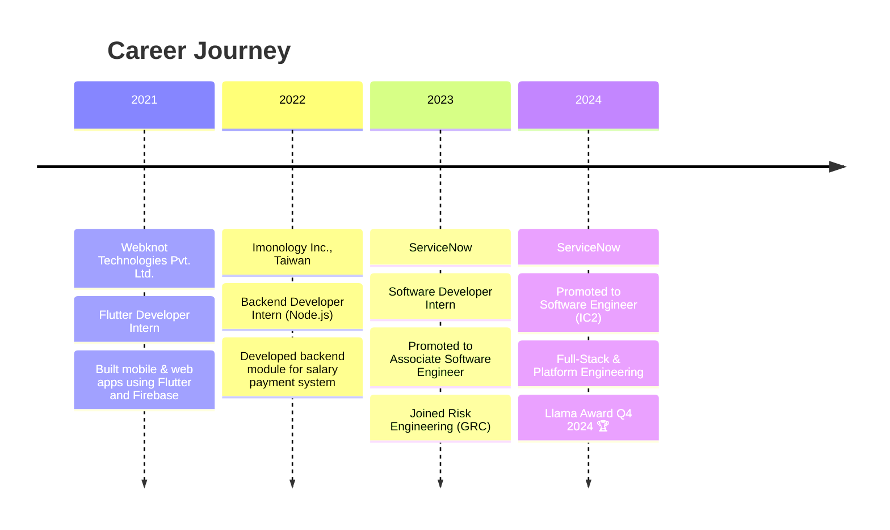

<!-- Animated Header Banner -->

  

<!-- Typing Animation -->

  <a href="https://git.io/typing-svg">
    <!-- ================= HEADER ================= -->

  </a>

 

<!-- Profile Views & Badges -->

  
  
  
 

 

<!-- About Section with Lottie -->
<table>
<tr>
<td width="60%" valign="top">

### 🚀 About Me

I'm a **Software Engineer (IC2)** at **[ServiceNow](https://www.servicenow.com/)**, building **high-performance full-stack platforms** and **event-driven architectures**, focused on enhancing **system scalability**, optimizing performance, and delivering **enterprise-grade software solutions**.

🔹 **Performance Optimization**: Achieved **30% faster execution** through query optimization & multi-threading  
🔹 **System Design**: Built fiscal year engines processing **1M+ metrics**  
🔹 **Innovation**: Built expression parsers with **50+ level visualization**  
🔹 **GenAI Pioneer**: Building automation tools using Windsurf AI  

**Currently exploring**: ML/AI, GenAI automation, distributed systems.

</td>

<td width="40%" align="center">

</td>
</tr>
</table>

<!-- Current Status Cards -->
## ⚡ Current Status

  

 

<!-- Tech Stack with Animated Icons -->
## 🛠️ Tech Stack & Tools

### Languages

  

### Frameworks & Libraries

  

### Databases & Cloud

  

### Specialized

  
  
  
  

 

<!-- Experience Timeline -->
## 💼 Professional Experience

 

<!-- Detailed Experience -->

<b>🔍 Detailed Experience at ServiceNow</b>

 

## **Software Engineer (IC2)** | *Jun 2023 – Present* | Hyderabad, India  
**Risk Engineering (GRC Platform)**

### ⚡ Platform Performance & Backend Engineering
- Optimized event-driven backend systems by redesigning database queries and transaction flows → **30% performance improvement**
- Built multi-threaded and asynchronous processing pipelines improving scalability and parallel execution
- Contributed to system design discussions on scalability, fault tolerance, and observability

### 🧮 Product Engineering & Full-Stack Development
- Developed scalable **JavaScript Expression Parser** supporting complex operators and **50+ level visualization trees**
- Enhanced Seismic UI Spreadsheet component, resolving cyclic JSON processing and improving execution time by **27%**
- Built configurable UI templates supporting hierarchical records and dynamic layouts
- Implemented global fiscal-year engine supporting **1M+ metrics** across regions

### 🔗 Integrations & Enterprise Features
- Enhanced ServiceNow–Microsoft Office 365 integration
- Added new data sources and transformed analytics data into Word API–compatible XML

### 🤖 GenAI & Automation
- Built Windsurf-powered GenAI tools for KB analysis, PR reviews, and incident resolution workflows
- Automated engineering workflows reducing manual effort and turnaround time

### 🧪 Testing & Reliability
- Implemented Java Selenium and JavaScript unit tests achieving **85% code coverage**
- Contributed to defect triage, documentation, and engineering best practices

### 🚨 Production Support
- Provided on-call support across **10+ GRC products**, resolving high-priority global customer issues

---

## **Software Developer Intern** | *Jan 2023 – Jun 2023*

- Built full-stack CSR application using ServiceNow Studio, Flow Designer, and UI Builder
- Designed scalable databases, workflows, and integrations using Glide APIs

 

<!-- Featured Projects -->
## 🚀 Featured Projects

| Project | Description | Tech Stack | Links |
|---------|-------------|------------|-------|
| **ForYou** | Blockchain-based DApp for decentralized fundraising with 100% transparency | React, Next.js, Web3.js, Solidity, Node.js | [Repo](https://github.com/SRV1030/DAPP-ForYou) |
| **CryptD** | Flutter-based encryption & privacy tool for secure file sharing | Flutter, Dart, C++, Express.js, MongoDB | [Repo](https://github.com/SRV1030/CryptD) |
| **Expression Visualizer** | Interactive mathematical expression tree renderer (50+ levels) | JavaScript, ServiceNow, Seismic UI | Internal |
| **GRC Spreadsheet** | High-performance spreadsheet component with cyclic JSON handling | ServiceNow, Seismic UI | Internal |

 

<!-- GitHub Stats -->
## 📊 GitHub Analytics

<!-- ================= STREAK ================= -->

 

<!-- ================= ACTIVITY GRAPH ================= -->

 

<!-- Achievements -->
## 🏆 Achievements & Recognition

| 🏅 Award | 📅 Year | 📝 Details |
|----------|---------|------------|
| **ServiceNow Llama Award** | 2024 | Q4 2024 - Exceptional performance & contributions |
| **LeetCode 1800+ Rating** | 2024 | Global Rank 4622 - Top 5% problem solver |
| **Smart India Hackathon Finalist** | 2022 | National level finalist among 10000+ teams |
| **Int. Robotics Yantra 5.0** | 2020 | **Winner** - International robotics competition |
| **Study In India Scholarship** | 2019 | Full bright scholarship for B.Tech at NIT Silchar |
| **Assam StartUp Pre-Incubation** | 2021 | Selected for E-Us startup program |
| **3x Pitch Competition Winner** | 2021-22 | Winner at Srijan & other entrepreneurship events |

 

<!-- Coding Profiles -->
## 🎯 Coding Profiles

  

 

<!-- Connect Section -->
## 🤝 Let's Connect

 

<!-- Quote -->

  

 

<!-- Footer -->

  

  
**💡 Open to collaborations in Fullstack Engineering, Blockchain, and GenAI automation**

*Built with ❤️ by Sourabh Shah | Software Engineer @ ServiceNow*

<!-- Hidden SEO Keywords -->
<!--
Fullstack Engineer | ServiceNow Developer | Blockchain Developer | Web3 | Solidity | Java | JavaScript | Python | System Design | GRC | GenAI | Automation | NIT Silchar | Hyderabad | India
-->
